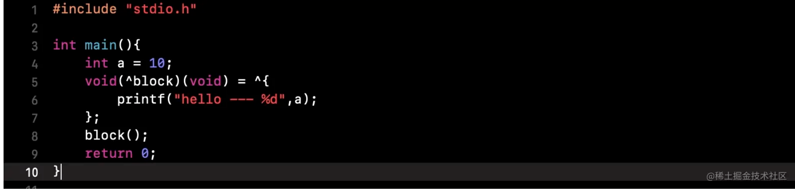
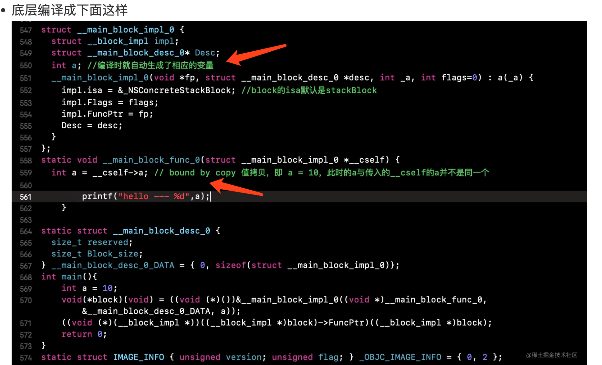
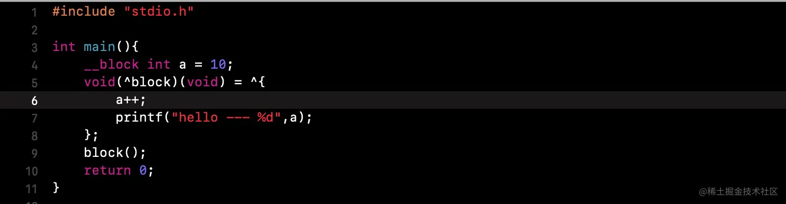
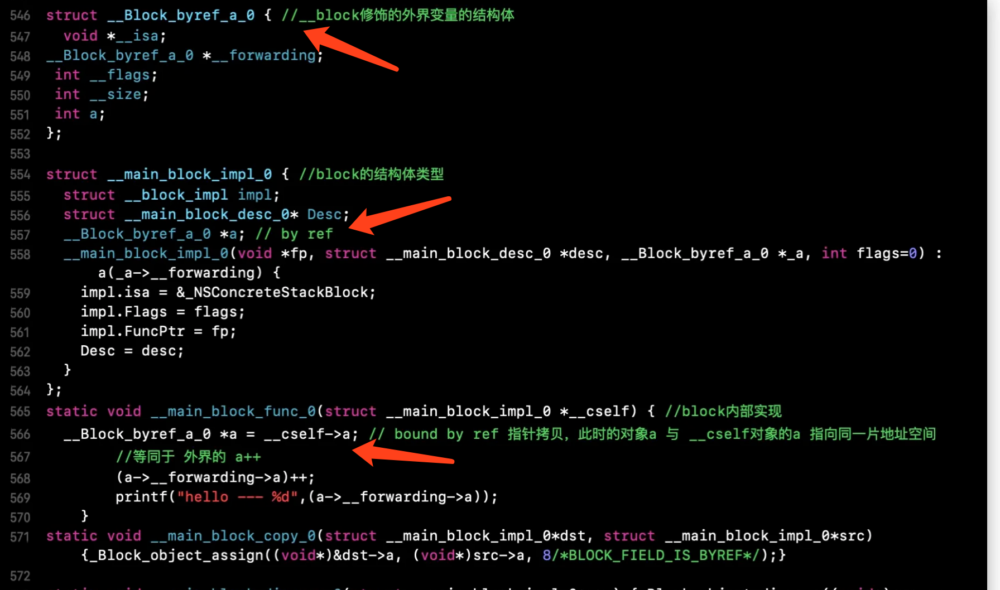

# Block
* **[Block的类型](#block的类型)**


> xcrun -sdk iphonesimulator clang -arch x86_64 -rewrite-objc xxx.m(xxx.c)

block匿名函数,也是一个OC对象，因为有isa指针

## 例子
```
    NSMutableArray *a = [NSMutableArray array];
    void(^blk)(void) = ^{
        [a addObject:@1];
    };
    blk();
```

```
    NSMutableArray *a = [NSMutableArray array];
    void(^blk)(void) = ^{
        /// 编译器报错
        a = [NSMutableArray array];
    };
    blk();
```
 虽然 `NSMutableArray *a` 被截获了，但是依然能对 a 数组进行添加数据操作，这是因为 Block 截获的只是 a 对象本身，不对可操作数据内部进行截获，也就是说：**对于自动变量对象只要对象指针地址不发生改变，便能正常使用；对于自动变量为值类型的只要值不发生改变，便能正常使用。**

### Block的类型
* _NSConcreteGlobalBlock: 
	
> 没有用到外界变量或只用到全局变量、静态变量的block为_NSConcreteGlobalBlock，生命周期从创建到应用程序结束。

* _NSConcreteStackBlock

> 只用到外部局部变量、成员属性变量，且没有强指针引用的block都是StackBlock。
StackBlock的生命周期由系统控制的，一旦返回之后，就被系统销毁了。

* _NSConcreteMallocBlock

> 有强指针引用或copy修饰的成员属性引用的block会被复制一份到堆中成为MallocBlock，没有强指针引用即销毁，生命周期由程序员控制

在ARC环境下系统会默认把 StackBlock copy 到堆上 变为MallocBlock

### 打破循环引用
1. 打破self对block的强引用，可以将`block`属性使用`weak`修饰，但是这样会导致`block`还没创建完就被释放，所以这种方式不可行.
2. 打破block对self的强引用：

	1. `weak-strong-dance`
	2. `__block`(`block`内对象置空，且调用`block`)
	3. 将对象`self`作为`block`的参数
	4. 通过`NSProxy`的子类代替`self`

### Block引用外部变量

外界变量通过`__block`生成`__Block_byref_a_0`结构体

`结构体`用来`保存原始变量的指针和值`

将变量生成的`结构体对象的指针地址`传递给`block`，然后在`block`内部就可以对外界变量进行操作了。

`__block`和非`__block`修饰局部变量产生两种不同的拷贝：

1. 非`__block`修饰：`值拷贝` -` 深拷贝`，只是拷贝数值，且拷贝的值不可更改，指向不同的内存空间。	


2. `__block修饰`：`指针拷贝` - `浅拷贝`，`生成的对象`指向`同一片内存空间`。



### Block中可以修改全局变量，全局静态变量，局部静态变量，局部变量吗？
* 可以修改全局变量，全局静态变量，因为全局变量 和 静态全局变量是全局的，作用域很广,block可以访问到
* 可以修改局部静态变量，不可以修改局部变量	
	* 局部静态变量（static修饰的） 和 局部变量，被block从外面捕获，成为 __main_block_impl_0这个结构体的成员变量
	* 局部变量是以值方式传递到block的构造函数中的，只会捕获block中会用到的变量，由于只捕获了变量的值，并非内存地址，所以在block内部不能改变局部变量的值
	* 局部静态变量是以指针形式，被block捕获的，由于捕获的是指针，所以可以修改局部静态变量的值
* ARC环境下，一旦使用__block修饰并在block中修改，就会触发copy操作，block就会从栈区copy到堆区，此时的block是堆区block
* ARC模式下，Block中引用id类型的数据，无论有没有__block修饰，都会retain，对于基础数据类型，没有__block修饰就无法修改变量值；如果有__block修饰，也是在底层修改__Block_byref_a_0结构体，将其内部的forwarding指针指向copy后的地址，来达到值的修改


