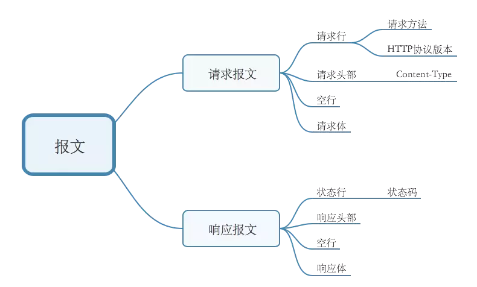

# HTTP 与 HTTPS
* [HTTP协议：超文本传输协议](#HTTP协议：超文本传输协议)
* [HTTPS和HTTP的区别](#HTTPS和HTTP的区别)

## HTTP协议：超文本传输协议
是一种详细规定了浏览器和万维网(www = world wide web)服务器之间相互通信的规则，通过因特网传输万维网文档的数据传输协议。

HTTP是基于TCP的**应用层**协议

(OSI网络七层协议从上到下分别数**应用层**，**表示层**，**会话层**，**传输层**，**网络层**，**数据链路层**，**物理层**)

### 1. 请求/响应报文



#### 1.1 请求报文包含 请求行，首部行(请求头部), 空行, 请求体, 如下:

```
POST /somedir/page.html HTTP/1.1    
//以上是请求行:方法字段、URL字段和HTTP版本字段
Host: www.user.com
Content-Type: application/x-www-form-urlencoded
Connection: Keep-Alive
User-agent: Mozilla/5.0.    
Accept-lauguage: fr  
//以上是首部行
（此处必须有一空行）  //空行分割header和请求内容 
name=world   请求体
```
**Host**：指明了该对象所在的主机

**Connection**：Keep-Alive首部行用来表明该浏览器告诉服务器使用持续连接

**Content-Type**: x-www-form-urlencoded首部行用来表明 HTTP会将请求参数用key1=val1&key2=val2的方式进行组织，并放到请求实体里面

**User-agent**：首部行用来指明用户代理，即向服务器发送请求的浏览器类型

**Accept-lauguage**：首部行表示用户想得到该对象的法语版本（如果服务器中有这样的对象的话），否则，服务器应发送它的默认版本

#### 1.2 响应报文包含 状态行, 首部行(响应头部), 空行， 响应体。 如下:

```
HTTP/1.1 200 OK    
//以上是状态行：协议版本字段、状态码、相应状态信息
Connection：close
Server:Apache/2.2.3(CentOS)
Date: Sat, 31 Dec 2005 23:59:59 GMT
Content-Type: text/html
Content-Length: 122
//以上是首部行
（此处必须有一空行）  //空行分割header和实体主体
(data data data data)//响应实体主体
```
	
一些常见的状态码和对应的短语:

* **200 OK**: 请求成功，信息在返回的响应报文中
* **301 Moved Permanently**: 请求的对象已经被永久转移了，新的URL定义在响应报文中的Location：首部行中。客户软件将自动获取新的URL
* **400 Bad Request**: 一个通用差错代码，指示该请求不能被服务器理解
* **404 Not Found**: 被请求的文件不在服务器上
* **505 HTTP Version Not Supported**: 服务器不支持请求报文使用的HTTP协议版本

> 4 开头的状态码通常是客户端的问题，5 开头的则通常是服务端的问题

**Connection**：close首部行告诉客户，发送完报文后将关闭TCP连接。

**Date**:指的不是对象创建或最后修改的时间，而是服务器从文件系统中检索到该对象，插入到响应报文，并发送该响应报文的时间。

**Server**: 首部行指示该报文是由一台Apache Web服务器产生的，类似于HTTP请求报文里的User-agent

**Content-Length**：首部行指示了被发送对象中的字节数

**Content-Type**：首部行指示了实体体中的对象是HTML文本

### 2. HTTP的请求方式
**GET**, **POST**, **PUT**, **DELETE**, **HEAD**, **OPTIONS**

#### 从语义的角度来看:
**GET**: 获取资源是安全的，幂等的，可缓存的	
**POST**: 获取资源是 非安全的，非幂等的，不可缓存的

> GET和POST本质上就是TCP链接，并无差别。但是由于HTTP的规定和浏览器的/服务器的限制，导致他们在应用过程中体现出一些不同。	

GET直接将参数拼接到请求链接之后，POST将参数放入到请求体body中	

在响应时，GET产生一个TCP数据包；POST产生两个TCP数据包；	
对于GET请求，浏览器会把Header和实体一并发送出去，服务器响应200(返回数据);	
而对于POST，浏览器会先发送Header,服务端响应 100 Continue,浏览器再发送实体主体，服务器响应200(返回数据)。

#### GET相对于POST的优势是什么?

## 3.HTTP的特点
**无连接**，**无状态**

### 3.1 HTTP无状态
即协议对于事务处理没有记忆能力。每次请求都是独立的，它的执行情况和结果与前面的请求和之后的请求时无直接关系的，它不会受前面的请求应答情况直接影响，也不会直接影响后面的请求应答情况。也就是说**服务器中没有保存客户端的状态，客户端必须每次带上自己的状态去请求服务器**，标准的HTTP协议指的是不包括cookies，session，application的HTTP协议。
### 3.2HTTP的持久连接
* 非持久连接: 每个连接处理一个 请求-响应 事务。
* 持久连接: 每个连接可以处理多个 请求-响应 事务

持久连接情况下，服务器发出响应后让TCP连接继续打开着。同一客户端/服务器之间的后续请求和响应都可以通过这个连接发送.
> HTTP/1.0 使用非持久连接，HTTP/1.1默认使用持久连接 ```<keep-alive>```

非持久连接的每个连接，TCP得在客户端和服务端分配TCP缓冲区，并维持TCP变量，会严重增加服务器负担。而且每个对象都有2个RTT(Round Trip Time，也就是一个数据包从发出去到回来的时间)的延迟，由于TCP的拥塞控制方案,每个对象都遭受TCP缓启动，因为每个TCP连接都起始于缓启动阶段。

## 4.HTTP持久连接怎么判断一个请求是否结束？
* ```Content-length```: 根据所接受字节是否达到```Content-length```的值
*  ```chunked(分块传输)```:```Transfer-Encoding```。当选择分块传输时，响应头中可以不包含```Content-length```,服务器会先回复一个不带数据的报文(只有响应行和\r\n)，然后开始传输若干个数据块。当传输若干个数据块后，需要再传输一个空的数据块，当客户端收到空的数据块时，则客户端知道数据接收完毕。

## HTTPS和HTTP的区别
HTTPS协议 = HTTP协议 + SSL/TLS协议	
SSL的全称为```Secure Sockets Layer```即安全套接层协议，是为网络通信提供安全及数据完整性的一种安全协议。TSL的全称为```Transport Layer Security```，即安全传输层协议。即HTTPS是安全的HTTP。

## HTTPS的连接建立流程
HTTPS为了兼顾安全和效率，同时使用了对称加密和非对称加密。在传输过程中会涉及三个秘钥(服务端的公钥，私钥还有客户端随机生成的秘钥)：
	
* 服务端的公钥和私钥，用于进行 **非对称加密**
* 客户端生成随机的秘钥，用来进行 **对称加密**