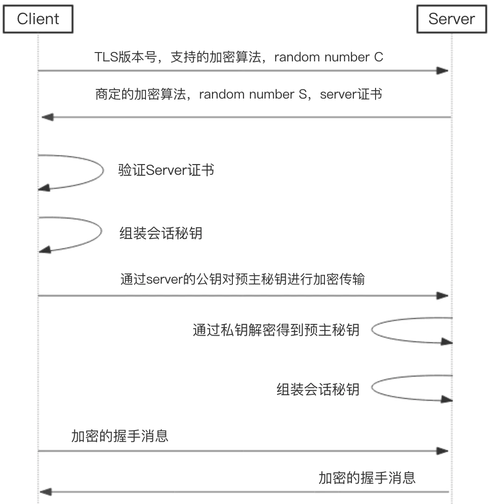
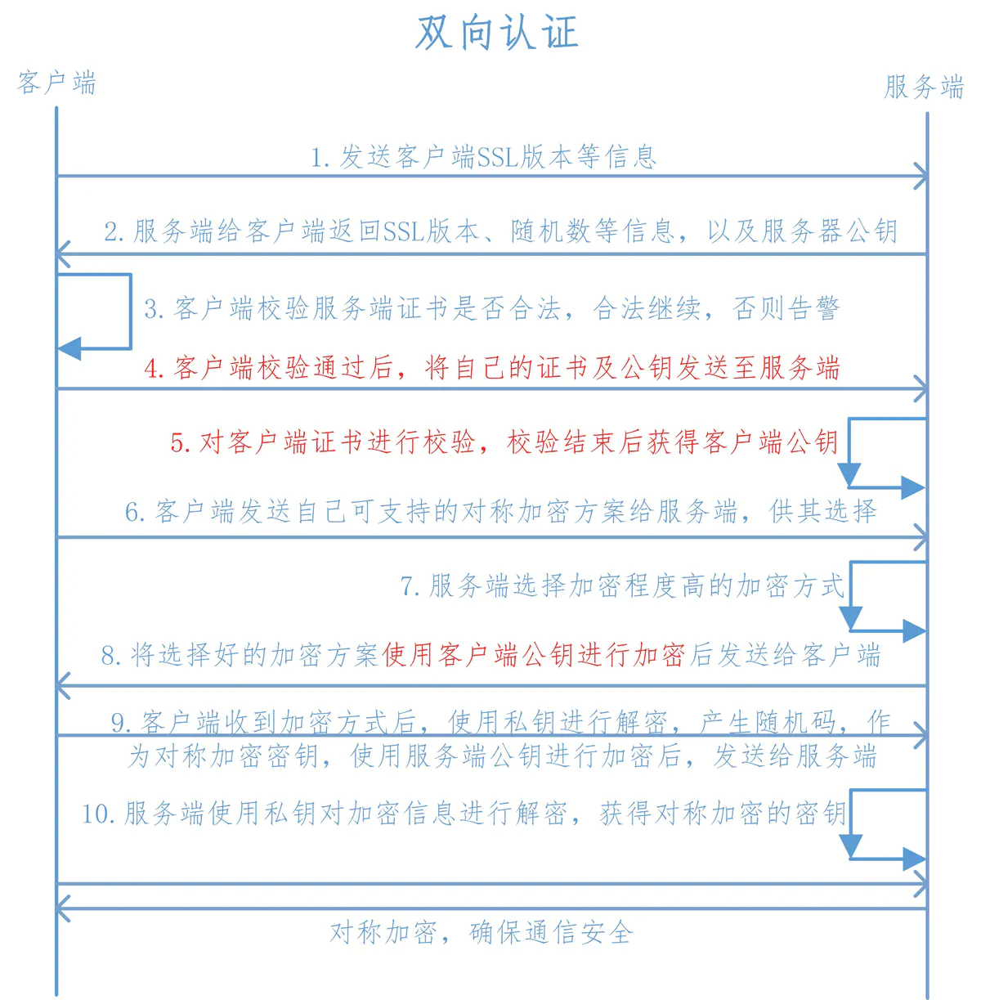
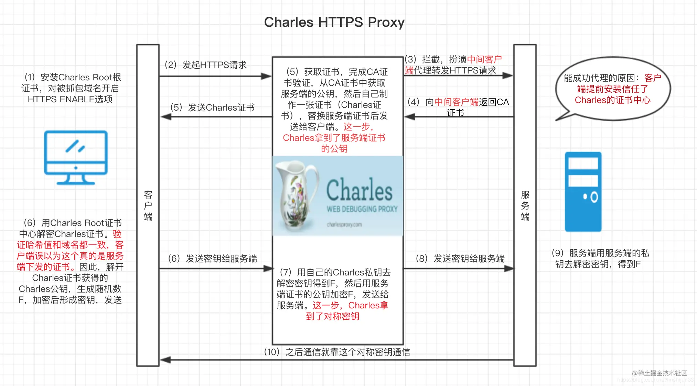
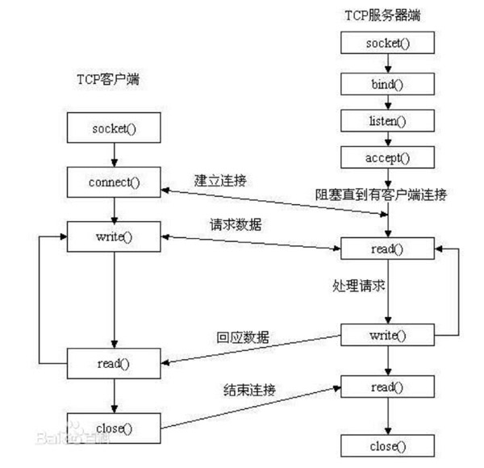

# HTTP 与 HTTPS
* [HTTP协议：超文本传输协议](#HTTP协议：超文本传输协议)
* [HTTPS和HTTP的区别](#HTTPS和HTTP的区别)

## DNS解析
DNS是一个域名系统，是万维网上作为域名和IP地址相互映射的一个分布式数据库。能够使用户更加方便的访问互联网，而不用去记住能够被机器直接读取的IP字符创。

**DNS解析过程:**

以www.163.com为例:

本地DNS服务器 -> DNS根服务器 -> 域名服务器 -> 域名解析服务器 -> 本地DNS服务器

1. 客户端打开浏览器，输入域名，这时，客户端会发送一个DNS请求到本地的DNS服务器，本地DNS服务器一般都是你网络接入服务商提供，如中国电信，中国移动等。
2. 查询www.163.com的DNS请求到达本地NDS服务器后，本地DNS会查询它的缓存记录，如果缓存中有此条记录，就会直接返回结果，如果没有，本地DNS服务器会向DNS根服务器进行查询。
3. 根DNS服务器并没有记录具体的域名和IP地址的对应关系，而是告诉本地DNS服务器，你可以去域服务器上继续查找，并给出域服务器的地址。
4. 本地DNS服务器会继续向域服务器发出请求，当前例子中的域服务器为 .com 域服务器，域服务器收到请求后也不会直接返回域名和IP地址的对应关系，而是告诉本地DNS服务器，你的域名解析服务器的地址。
5. 最后，本地DNS服务器向域名解析服务器发出请求，这时会得到一个域名和IP的对应关系。本地DNS服务器不仅把IP地址返回给用户电脑，还会把这个对应关系保存到缓存中，以备下次别的用户查询时，可以直接返回结果，加快网络访问。


## TCP三次握手
1. 客户端向服务端发送一个特殊的报文段(SYN=1,Seq=click_isn),即SYN报文段,这时客户端TCP进入SYN_SENT(发送)状态，等待服务端确认并将SYN比特置为1的报文段。
2. 服务端收到客户端SYN报文段后，服务端会为该TCP连接分配TCP缓存和变量，进入SYN_RCVD(收到)状态，并向客户端发送允许链接的报文段(SYN=1,Seq=click_isn+1,ACK= server_isn),即SYNACK报文段。
3. 客户端收到SYNACK报文段后，也会为该TCP分配变量和缓存，客户端TCP进入(ESTABLISHED建立)状态，并向服务端发送一个(SYN=0,Seq= click_isn+1,ACK= server_isn+1)的报文，服务段收到这个报文后也进入到(ESTABLISHED建立)状态。

## 为什么TCP需要三次握手
为了防止已经失效的连接请求报文段突然又传到服务端，因而产生错误。

比如: 客户端发出第一个连接请求报文段并没有丢失，而是因为网络结点长时间滞留，导致延误到连接释放以后的某个时间才到达服务端。这个时候这个报文段其实已经失效了，但是服务端不知道，它收到这个失效的报文段后，误以为客户端再次发出一个新的连接请求，于是服务端想客户端发送确认报文段，如果没有"三次握手"，只要服务端发出确认报文，新的连接就建立了，但是客户端并没有发出新建立连接的请求，因此也不会理睬服务端的确认，也不会像服务端发送数据，但服务端却以为新的连接已经建立了，并一直等待客户端发来数据，造成了服务端很多资源被白白浪费了

## TCP四次挥手
1. 客户端发出一个关闭的指令，会引起客户端向服务端发送一个（FIN=1）的报文段，同时客户端进入到```FIN_WAIT_1```（等待结束1）的状态，并等待服务端带有确认的TCP报文段。
2. 服务端像客户端发送ACK=1的确认报文，客户端收到确认报文后，客户端进入```FIN_WAIT_2```（等待结束2）的状态，等待服务端的FIN=1报文段(这个时间可能服务端在继续给服务端传递数据)
3. 服务端发送自己的终止FIN=1的报文段
4. 客户端收到服务端FIN=1的报文段后，像服务端发送一个确认报文段ACK=1

## 为什么TCP需要四次挥手?
TCP是双工模式，当客户端向服务端发送FIN报文的时候，只是表示客户端已经没有数据要发送给服务端了，但这时候客户端还是可以继续接收服务端的数据，当服务端返回ACK确认报文后，表示它知道客户端没有数据发送了，但服务端还是可以给客户端发送数据的，当服务端也发送FIN报文时，表示服务端也没有数据要发送了，客户端收到服务端FIN报文后也给服务端发送ACK确认报文，服务端收到客户端的确认报文，就会断开这次TCP 的连接。

## 如何保证TCP四次挥手中，客户端的ACK能达到服务端
如果客户端发送的ACK丢失，服务端获取不到，服务端会不断的发送FIN报文，
在客户端收到服务端的FIN报文后，有个2MSL时间等待时间去轮询发送ACK确认报文给服务端，保证服务端可以,或者服务端超时退出。


## HTTP协议：超文本传输协议
是一种详细规定了浏览器和万维网(www = world wide web)服务器之间相互通信的规则，通过因特网传输万维网文档的数据传输协议。

HTTP是基于TCP的**应用层**协议

(OSI网络七层协议从上到下分别为**应用层**，**表示层**，**会话层**，**传输层**，**网络层**，**数据链路层**，**物理层**)
(TCP/TP四层模型从上到下分别为 **应用层**，**传输层**，**网络层**，**数据链路层**)


### 1. 请求/响应报文


#### 1.1 请求报文包含 请求行，首部行(请求头部), 空行, 请求体, 如下:

```
POST /somedir/page.html HTTP/1.1    
//以上是请求行:方法字段、URL字段和HTTP版本字段
Host: www.user.com
Content-Type: application/x-www-form-urlencoded
Connection: Keep-Alive
User-agent: Mozilla/5.0.    
Accept-lauguage: fr  
//以上是首部行
（此处必须有一空行）  //空行分割header和请求内容 
name=world   请求体
```
**Host**：指明了该对象所在的主机

**Connection**：Keep-Alive首部行用来表明该浏览器告诉服务器使用持续连接

**Content-Type**: x-www-form-urlencoded首部行用来表明 HTTP会将请求参数用key1=val1&key2=val2的方式进行组织，并放到请求实体里面

**User-agent**：首部行用来指明用户代理，即向服务器发送请求的浏览器类型

**Accept-lauguage**：首部行表示用户想得到该对象的法语版本（如果服务器中有这样的对象的话），否则，服务器应发送它的默认版本

#### 1.2 响应报文包含 状态行, 首部行(响应头部), 空行， 响应体。 如下:

```
HTTP/1.1 200 OK    
//以上是状态行：协议版本字段、状态码、相应状态信息
Connection：close
Server:Apache/2.2.3(CentOS)
Date: Sat, 31 Dec 2005 23:59:59 GMT
Content-Type: text/html
Content-Length: 122
//以上是首部行
（此处必须有一空行）  //空行分割header和实体主体
(data data data data)//响应实体主体
```
	
一些常见的状态码和对应的短语:

* **200 OK**: 请求成功，信息在返回的响应报文中
* **301 Moved Permanently**: 请求的对象已经被永久转移了，新的URL定义在响应报文中的Location：首部行中。客户软件将自动获取新的URL
* **400 Bad Request**: 一个通用差错代码，指示该请求不能被服务器理解
* **404 Not Found**: 被请求的文件不在服务器上
* **505 HTTP Version Not Supported**: 服务器不支持请求报文使用的HTTP协议版本

> 4 开头的状态码通常是客户端的问题，5 开头的则通常是服务端的问题

**Connection**：close首部行告诉客户，发送完报文后将关闭TCP连接。

**Date**:指的不是对象创建或最后修改的时间，而是服务器从文件系统中检索到该对象，插入到响应报文，并发送该响应报文的时间。

**Server**: 首部行指示该报文是由一台Apache Web服务器产生的，类似于HTTP请求报文里的User-agent

**Content-Length**：首部行指示了被发送对象中的字节数

**Content-Type**：首部行指示了实体体中的对象是HTML文本

### 2. HTTP的请求方式
**GET**, **POST**, **PUT**, **DELETE**, **HEAD**, **OPTIONS**

#### 从语义的角度来看:
**GET**: 获取资源是安全的，幂等的，可缓存的	
**POST**: 获取资源是 非安全的，非幂等的，不可缓存的

> GET和POST本质上就是TCP链接，并无差别。但是由于HTTP的规定和浏览器的限制，导致他们在应用过程中体现出一些不同。	

GET直接将参数拼接到请求链接之后，POST将参数放入到请求体body中	

**在响应时，GET产生一个TCP数据包；POST产生两个TCP数据包；**	
对于GET请求，浏览器会把Header和实体一并发送出去，服务器响应200(返回数据);	
而对于POST，浏览器会先发送Header,服务端响应 100 Continue,浏览器再发送实体主体，服务器响应200(返回数据)。

#### GET相对于POST的优势是什么?

## 3.HTTP的特点
**无连接**，**无状态**

### 3.1 HTTP无状态
即协议对于事务处理没有记忆能力。每次请求都是独立的，它的执行情况和结果与前面的请求和之后的请求时无直接关系的，它不会受前面的请求应答情况直接影响，也不会直接影响后面的请求应答情况。也就是说**服务器中没有保存客户端的状态，客户端必须每次带上自己的状态去请求服务器**，标准的HTTP协议指的是不包括cookies，session，application的HTTP协议。
### 3.2HTTP的持久连接
* 非持久连接: 每个连接处理一个 请求-响应 事务。
* 持久连接: 每个连接可以处理多个 请求-响应 事务

持久连接情况下，服务器发出响应后让TCP连接继续打开着。同一客户端/服务器之间的后续请求和响应都可以通过这个连接发送.
> HTTP/1.0 使用非持久连接，HTTP/1.1默认使用持久连接 ```<keep-alive>```

非持久连接的每个连接，TCP得在客户端和服务端分配TCP缓冲区，并维持TCP变量，会严重增加服务器负担。而且每个对象都有2个RTT(Round Trip Time，也就是一个数据包从发出去到回来的时间)的延迟，由于TCP的拥塞控制方案,每个对象都遭受TCP缓启动，因为每个TCP连接都起始于缓启动阶段。

## 4.HTTP持久连接怎么判断一个请求是否结束？
* ```Content-length```: 根据所接受字节是否达到```Content-length```的值
*  ```chunked(分块传输)```:```Transfer-Encoding```。当选择分块传输时，响应头中可以不包含```Content-length```,服务器会先回复一个不带数据的报文(只有响应行和\r\n)，然后开始传输若干个数据块。当传输若干个数据块后，需要再传输一个空的数据块，当客户端收到空的数据块时，则客户端知道数据接收完毕。

## HTTPS和HTTP的区别
HTTPS协议 = HTTP协议 + SSL/TLS协议	
SSL的全称为```Secure Sockets Layer```即安全套接层协议，是为网络通信提供安全及数据完整性的一种安全协议。TSL的全称为```Transport Layer Security```，即安全传输层协议。即HTTPS是安全的HTTP。

## HTTPS的连接建立流程
HTTPS为了兼顾安全和效率，同时使用了对称加密和非对称加密。在传输过程中会涉及三个秘钥(服务端的公钥，私钥还有客户端随机生成的秘钥)：
	
* 服务端的公钥和私钥，用于进行 **非对称加密**
* 客户端生成随机的秘钥，用来进行 **对称加密**



### HTTPS默认单向认证流程:
[图解HTTPS](https://mp.weixin.qq.com/s/1ojSrhc9LZV8zlX6YblMtA)

[另一种官方说法](https://www.jianshu.com/p/1f426385ba53)

服务器会使用自己的公钥向证书颁发机构申请证书。

1. 客户端向服务端发送SSL协议版本号，加密算法种类，随机数等信息。
2. 服务端给客户端返回SSL协议版本号，筛选出来的加密算法种类，随机数等信息，同时也返回服务端的证书，即公钥证书
3. 客户端使用服务端返回的信息验证服务器的合法性，包括：	
	* 证书是否过期
	* 发行服务器证书的CA机构是否可靠
	* 返回的公钥是否能正确解开返回证书中的数字签名
	* 服务器证书上的域名是否和服务器的实际域名相符
4. 验证通过后，将继续进行通信。否则终止通信
5. 客户端向服务器发送自己所支持的对称加密方案，供服务器选择
6. 服务器在客户端提供的加密方案中选择加密程度最高的加密方式
7. **服务端将选择好的加密方式通过明文的方式返回客户端**
8. 客户端接收到服务端返回的加密方式后，使用该加密方式生成随机码，用作通信过程中**对称加密的秘钥**，使用服务端返回的**公钥**加密，将加密后的随机码发送至服务端
9. 服务端收到客户端返回的加密信息后，使用自己的**私钥**进行解密，获取对称加密秘钥。在接下来的会话中，服务器和客户端将会使用该秘钥进行对称加密，保证通信过程中信息的安全。

## 双向认证



## 为什么需要CA认证机构颁发证书?
HTTP协议被认为不安全的是因为数据传输过程中容易被监听者勾线监听，伪造服务器，而HTTPS协议主要是解决网络传输的安全性问题。

首先假设不存在认证机构，任何人都可以制造证书，这带来的安全风险便是经典的**"中间人攻击"**问题。

中间人攻击的具体过程:



1. 本地请求被劫持(如 DNS劫持等),所有的请求均被发送到中间人的服务器
2. 中间人服务器返回中间人自己的证书
3. 客户端创建随机数，通过中间人证书的公钥对随机数加密后传给中间人，然后凭随机数构造对称加密对传输内容进行加密传输。
4. 中间人因为拥有客户端的随机数，可以通过对称加密算法进行内容解密
5. 中间人以客户端的请求内容再向正规网站发起请求
6. 因为中间人与与服务端的通信过程是合法的，正规网站通过建立的安全通道返回加密后的数据
7. 中间人凭借与正规网站建立的对称加密算法对内容进行解密
8. 中间人通过与客户端建立的对称加密算法对正规网站返回的数据进行加密传输
9. 客户端通过与中间人建立的对称加密算法对返回结果数据进行解密

由于缺少了对证书的验证，所以客户端虽然发起的是HTTPS请求，但客户端完全不知道自己的网络已被拦截，传输内容被中间人全部窃取。

权威机构是要认证的，不是随便一个机构都有资格颁发证书，不然也不会被叫做权威机构。证书虽然是公开的，中间人可以获取到证书，这就涉及到了非对称加密中公私钥的用处了，证书可以被获取，但是私钥是无法获取的，一份公钥是不可能推出其私钥，中间人即使拿到了证书也无法伪装成合法服务器，因为无法对客户端传入的加密数据进行解密。

## Socket



Socket 套接字,长连接，它是一个针对TCP/IP协议的封装，Socket本身不是一个协议而是一个调用接口，通过Socket，我们才能使用TCP/IP协议。

建立Socket连接至少需要一对套接字，其中一个运行于客户端，称为ClientSocket。另一个运行于服务器端，称为ServerSocket。

套接字之间的连接过程分为三个步骤: 服务端监听，客户端请求，连接确认。

服务端监听:  服务器端套接字并不定位具体的客户端套接字，而是处于等待连接的状态，实时监控网络状态，等待客户端的连接请求。

客户端请求：指客户端的套接字提出连接请求，要连接的目标是服务器端的套接字。为此，客户端的套接字必须首先描述它要连接的服务器的套接字，指出服务器端套接字的地址和端口号，然后就向服务器端套接字提出连接请求。

连 接确认：当服务器端套接字监听到或者说接收到客户端套接字的连接请求时，就响应客户端套接字的请求，建立一个新的线程，把服务器端套接字的描述发给客户端，一旦客户端确认了此描述，双方就正式建立连接。而服务器端套接字继续处于监听状态，继续接收其他客户端套接字的连接请求。

## Socket心跳包
时间间隔在3-5分钟，因为默认5分钟后会将非活跃的连接断开。

## 数据粘包处理

1.发送方将数据包加上包头和包尾,包头、包体以及包尾用字典形式包装成json字符串,接收方,通过解析获取json字符串中的包体,便可进行进一步处理.

```
{
// head:包头,body:包体,end:包尾
 NSDictionary *dict = @{
               @"head" : @"phoneNum",
               @"body" : @(13133334444),
               @"end" : @(11)};
              }
```


2.添加前缀.和包内容拼接成同一个字符串.但是只能处理`完整型`情况

	如发送数据： `13133334444 ` 出现黏包	
	`13133334444`	
	`1313333444413133334444`	
	可以添加 xxx做为前缀：	
	`xxx13133334444 `	
	`xxx13133334444xxx13133334444`	
	以xxx为分隔符,将每个包内容存入数组中,再取对应数组中的数据操作即可.
	

	

## Socket连接与HTTP连接

Socket 连接一旦建立，通信双方就可以开始相互发送数据内容，直到双方连接断开。但是在实际网络应用中，客户端到服务端的通信往往需要穿越多个中间结点，例如：路由器，网关，防火墙等。大部分防火墙默认会关闭长时间处于非活跃状态的连接而导致Socket连接短连，因此需要轮询告诉网络(**心跳包**)，该连接处于活跃状态。
而HTTP连接使用的是"请求-响应"的方式，不仅在请求时需要建立连接，而且只能在客户端向服务端发出请求后，服务端才能回复数据。

1. HTTP是短连接, Socket(基于TCP协议的)是长连接. 尽管HTTP1.1开始支持持久连接, 但仍无法保证始终连接. 而Socket连接一旦建立TCP三次握手, 除非一方主动断开, 否则连接状态一直保持.

2. HTTP连接服务端无法主动发消息, Socket连接双方请求的发送先后无限制。 HTTP采用"请求-响应"机制, 在客户端还没发送消息给服务端钱, 服务端无法推送消息给客户端. 必须满足客户端发送消息在前, 服务端回复在后. Socket连接双方通话无限制.

## 总结
Q: HTTPS为什么安全?	
A: 因为HTTPS保证了传输安全，防止传输过程中被监听，防止数据被窃取，可以确认网站的真实性

Q: HTTPS的传输过程是怎么样的?		
A:客户端发起HTTPS请求，服务端返回证书，客户端对证书进行验证，验证通过后本地生成用于对称加密算法的**随机数**，通过证书中的**公钥**对**随机数**进行非对称加密传输给服务端，服务端收到后通过**私钥**得到随机数，之后的数据交互通过对称加密算法进行数据的加解密

Q: HTTPS为什么需要证书？	
A: 防止"中间人"攻击，同时为网站提供身份证明。(双向验证的话可以验证客户端的有效性)

Q:使用HTTPS会被抓包吗?		
A: 会被抓包,HTTPS只防止用户在不知情的情况下通信被监听，如果用户主动授信,是可以构建"中间人"网络，代理软件可以对传输内容进行解密