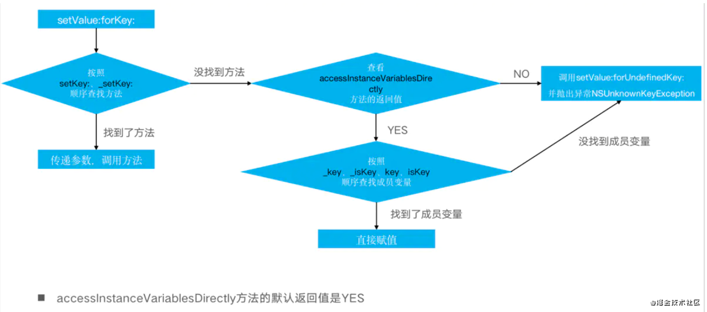
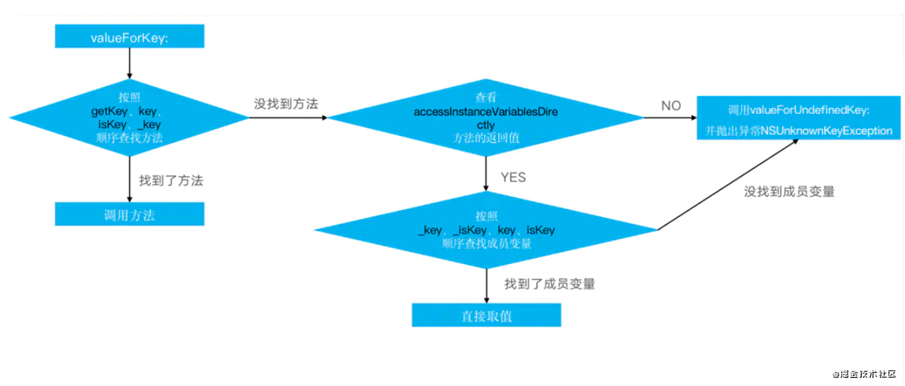

# kVC实现原理
* KVC(NSKeyValueCoding)键-值编码，是一个非正式的Protocol，提供一种可以直接使用字符串访问对象的属性的机制。KVO就是基于KVC实现的关键技术之一。KVC赋值取值的顺序:
	1. 	用KVC取值或者赋值，会优先调用这个属性的setter和getter方法
	2. setter 方法实质是调用 setKey,_setKey **方法顺序查找过程**
	3. getter 实质就是 getKey,key,isKey,_key  **方法顺序查找过程**
	4. 如果找不到 setter和 getter方法，且```+ accessInstanceVariablesDirectly```返回YES则按 ```_<key>```,```_is<key>```,```<key>```,```is<key>```的顺序查找**实例变量**,直接赋值。
	5. 如果找不到没有访问器方法和实例变量，则调用 ```-setValue:forUndefinedKey:```默认实现为引发崩溃

用KVC可以给类的私有属性或成员变量赋值。

## **`setValue:forKey:的原理`**


## **`value:forKey:的原理`**



## 面试
!. 通过KVC修改属性会触发KVO么?

* 会触发KVO, 相当于KVC内部会去手动调用`willChangeValueForKey:`和`didChangeValueForKey:`方法。
* 保证KVO的keypatch 和KVC的 keypatch 相同就能触发 (`key` or `_key`)

```
@property (nonatomic, copy) NSString *name;
[self addObserver:self forKeyPath:@"_name" options:NSKeyValueObservingOptionNew context:NULL];
[self setValue:@"123" forKey:@"_name"];
```


## 应用场景
1. 动态取值和赋值。
2. 访问类的私有属性和成员变量。
3. 结合运行时，实现字典转模型。