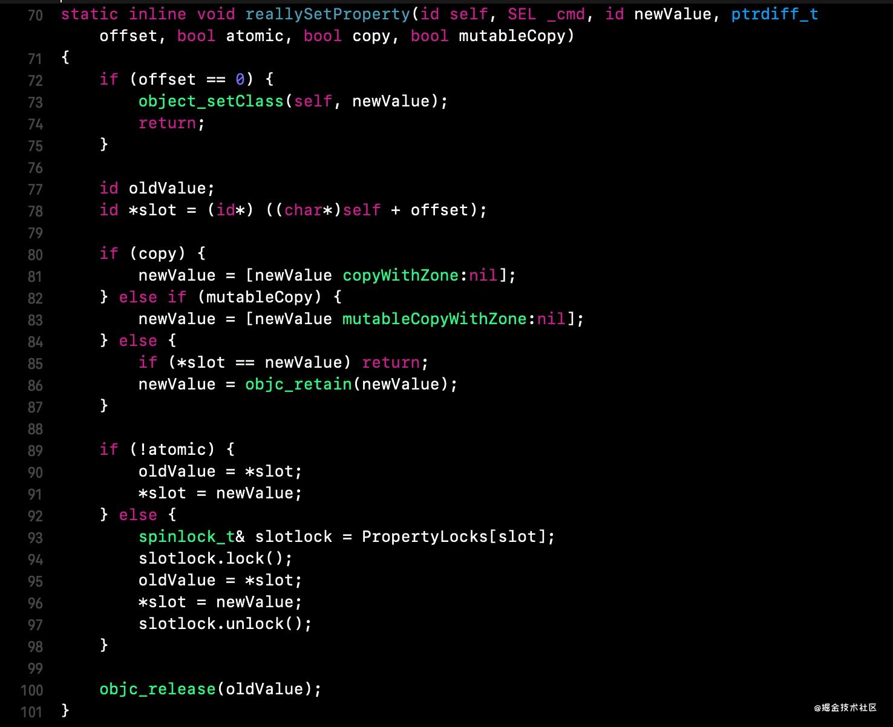
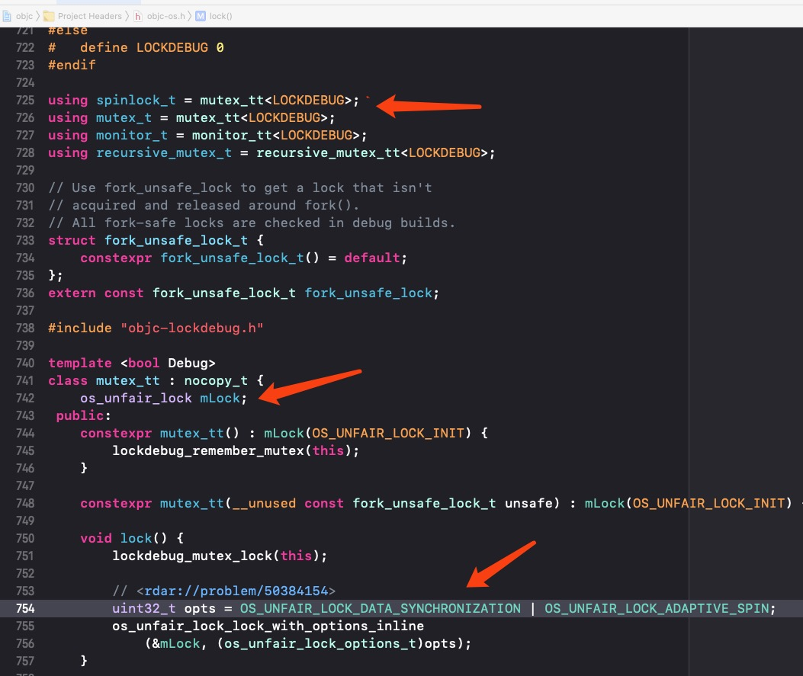

# iOS中的锁
https://juejin.cn/post/6844904167010467854#heading-14
https://juejin.cn/post/6937206660981063693#heading-4


- [1.锁的分类](#锁的分类)
- [2.互斥锁概念](#互斥锁概念)
-  [3.自旋锁概念](#自旋锁概念)
-  [4.互斥锁和自旋锁的区别](#互斥锁和自旋锁的区别)
-  [5.iOS中的自旋锁](#iOS中的自旋锁)
	- [5.1 OSSpinLock](#1.OSSpinLock(自旋锁))
	- [5.2 atomic](#2.atomic(原子锁))
	- [5.3 读写锁`pthread_rwlock_t`](#3读写锁`pthread_rwlock_t`)
- [6.iOS中的互斥锁](#iOS中的互斥锁)
	- [6.1 pthread_mutex](#1.pthread_mutex)
	- [6.2 @synchronized](#2.@synchronized)

XCode监测数据竞争： Edit Scheme -> Run -> Diagnostics -> Thread Sanitizer

> 使用锁一个注意点: **不要将过多的其他操作代码放到锁里面,否则一个线程执行的时候另一个线程就一直等待，无法发挥多线程的作用**。

##锁的分类
在iOS中锁的基本类型只有两种: `互斥锁`和`自旋锁。`其他比如`条件锁`、`递归锁`、`信号量`都是上层的封装和实现

##互斥锁概念
`互斥锁`(Mutual exclusion,缩写为`Mutex`): 防止两条线程同时对同一公共资源(比如全局变量)进行读写的机制。当获取锁操作失败后，线程会进入睡眠，等待锁被释放时被唤醒。

		
`互斥锁`又分为:	

* `递归锁`: 可重复如锁，同一线程在锁被释放前可再次获取锁，即可以递归调用。
* `非递归锁`: 不可重入，必须等待锁释放后才能再次获取锁。

##自旋锁概念
`自旋锁`: 线程反复检查所变量是否可用。由于线程一直在这一过程中保持执行，因此是一种`忙等待`。一旦获取了自旋锁，线程会一直保持该锁，直至显示释放自旋锁。

`自旋锁`避免了进程上下文的调度开销，因此对于线程只会堵塞很短时间的场合是有效的

##互斥锁和自旋锁的区别
* **`互斥锁`**在线程获取锁但没有获取到时，线程会进入休眠，等锁被释放时线程会被唤醒
* **`自旋锁`**线程会一直处于等待状态(忙等待)不会进入休眠 —— 因此效率高

##iOS中的自旋锁
### 1.OSSpinLock(自旋锁)
自从`OSSpinLock`出现了安全问题,在`iOS10`之后就被废弃了.自旋锁之所以不安全，是因为`自旋锁由于获取锁时，线程会一直处于忙等待状态`，造成了任务的优先级反转。

而`OSSpinLock`忙等的机制就可能造成高优先级一直`running等待`，占用CPU时间片；而低优先级任务无法抢占时间片，变成迟迟完不成，不释放锁的情况。

在`OSSpinLock`被弃用后，其替代方案是内部封装了`os_unfair_lock(一种互斥锁)`，而`os_unfair_lock`在获取锁操作失败时，线程会进入`休眠状态`，而不是自旋锁的忙等状态

###2.atomic(原子锁)
`atomic`适用于`OC`中属性的修饰符，其自带一把自旋锁，但是这个一般基本不使用，都是使用的nonatomic。

`setter`方法会根据修饰符调用不同方法，最后会统一调用`reallySetProperty`方法，其中就有`atomic`和`非atomic`的操作


对于atomic修饰的属性，进行了`spinlock_t`加锁处理，但是在前文中提到`OSSpinLock`已经废弃了，这里的spinlock_t在底层是通过`os_unfair_lock`替代了`OSSpinLock`实现的加锁.同时为了防止哈希冲突，还是用了`加盐操作`


> atomic只能保证setter、getter方法的线程安全，并不能保证数据安全

###3.读写锁`pthread_rwlock_t`
`读写锁`实际是一种特殊的`自旋锁`，它把对共享资源的访问者划分成读者和写者，读者只对共享资源进行读访问，写者则需要对共享资源进行写操作。这种锁相对于`自旋锁`而言，能提高并发性，因为在多处理器系统中，它允许同时有多个读者来访问共享资源，最大可能的读者数为实际的CPU数。

*  写者是排他性的，⼀个读写锁同时只能有⼀个写者或多个读者（与CPU数相关），但不能同时既有读者⼜有写者。在读写锁保持期间也是抢占失效的。
*  如果读写锁当前没有读者，也没有写者，那么写者可以⽴刻获得读写锁，否则它必须⾃旋在那⾥，直到没有任何写者或读者。如果读写锁没有写者，那么读者可以⽴即获得该读写锁，否则读者必须⾃旋在那⾥，直到写者释放该读写锁

```
// 导入头文件
#import <pthread.h>
// 全局声明读写锁
pthread_rwlock_t lock;
// 初始化读写锁
pthread_rwlock_init(&lock, NULL);
// 读操作-加锁
pthread_rwlock_rdlock(&lock);
// 读操作-尝试加锁
pthread_rwlock_tryrdlock(&lock);
// 写操作-加锁
pthread_rwlock_wrlock(&lock);
// 写操作-尝试加锁
pthread_rwlock_trywrlock(&lock);
// 解锁
pthread_rwlock_unlock(&lock);
// 释放锁
pthread_rwlock_destroy(&lock);

```
平时很少会直接使用读写锁`pthread_rwlock_t`，更多的是采用其他方式，例如使用**栅栏函数**完成读写锁的需求。

##iOS中的互斥锁
###1.pthread_mutex
`pthread_mutex` 就是 `互斥锁` 本身，当锁被占用，其他线程申请锁时，不是使用忙等，而是阻塞线程并睡眠。使用如下:

```
// 导入头文件
#import <pthread.h>
// 全局声明互斥锁
pthread_mutex_t _lock;
// 初始化互斥锁
pthread_mutex_init(&_lock, NULL);
// 加锁
pthread_mutex_lock(&_lock);
// 这里做需要线程安全操作
// ...
// 解锁 
pthread_mutex_unlock(&_lock);
// 释放锁
pthread_mutex_destroy(&_lock);
```
###2.@synchronized
`@synchronized`可能是日常开发中用的比较多的一种互斥锁，因为它的使用比较简单，但并不是在任意场景下都能使用`@synchronized`，且它的性能较低

###3.NSLock
NSLock是对`互斥锁pthread_mutex `的简单封装，在swift 的 [Foundation](https://github.com/apple/swift-corelibs-foundation)源码中看到，使用如下：