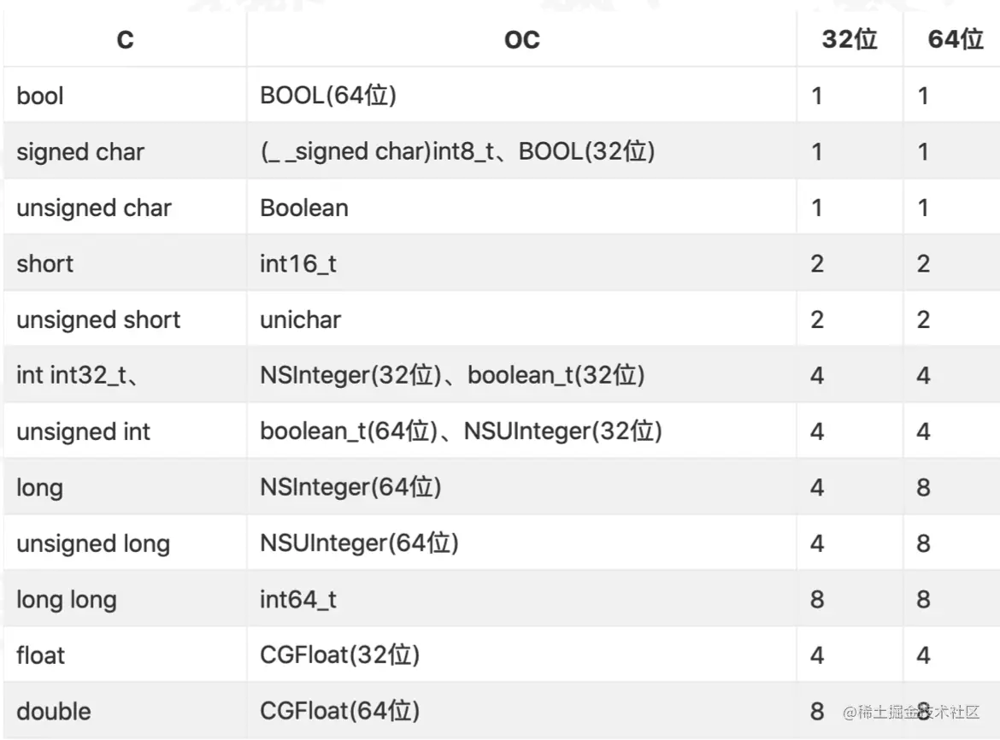
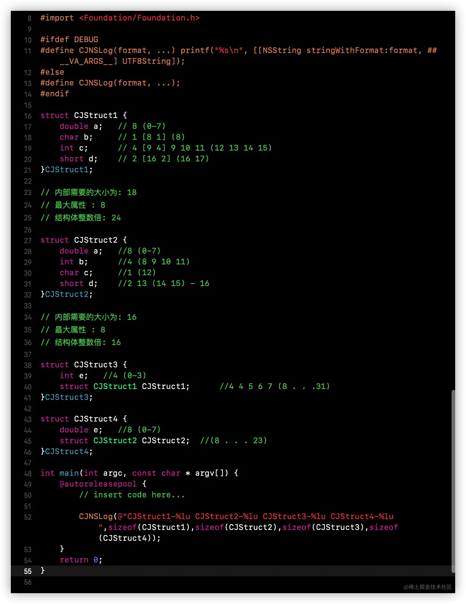

## 字节对齐
### 1. ```sizeof、class_getInstanceSize、malloc_size``` 的区别
* ```sizeof()``` 是一个运算符，不是函数。传入 **数据类型** ，输出内存大小，在 **编译时** 确定。只与数据类型有关，与具体数值无关。
	* 对于类似于 ```int``` 这样的基本数据而言， ```sizeof```获取的就是数据类型占用的内存大小，不同的数据类型所占用的内存大小是不一样的。
	* 而对于类似```NSObject```定义的实例对象而言，其对象类型的本质就是一个```结构体(即 Struct objc_object)的指针```,所以```sizeof(objc)```打印的是```对象objc的指针大小```,我们知道一个指针的内存大小是8字节，所以```sizeof(objc)```打印的是8。**注意：这里的8字节与```isa```指针一点关系都没有！！！**
	* 对于指针而言，```sizeof(objc)```打印的就是8，因为一个指针的内存大小就是8字节。
	
* ```class_getInstanceSize```：计算对象实际占用内存大小，这个需要依据类的属性而变化，如果自定义类没有自定义属性，仅仅只是继承自```NSObject```，则类的实例对象实际占用的内存大小是8，遵循8字节对齐。
* ```malloc_size```：计算对象实际分配的内存大小，这是系统完成的。实际分配和实际占用的内存大小可能并不相等。

### 2.对象的内存对齐
我们知道就对象整体而言，苹果系统采用16字节对齐开辟内存大小，提高系统存储性能。	
	
	对象本质是结构体，研究对象内部的内存，就是研究结构体的内存布局
	内存对齐目的：最大程度提高资源利用率。
	
###3.结构体内存对齐
**【三条内存对齐规则】**

1. 数据成员的对齐规则可以理解为```min(m, n)```的公式, 其中```m```表示当前成员的开始位置, ```n```表示当前成员所需位数.如果满足条件 ```m```整除 ```n``` （即 ```m % n == 0```）, ```n``` 从```m```位置开始存储, 反之继续检查 ```m+1``` 能否整除 ```n```, 直到可以整除, 从而就确定了当前成员的开始位置。
2. 数据成员为结构体：当结构体嵌套了结构体时，作为数据成员的结构体的自身长度作为外部结构体的最大成员的内存大小(即在确定复合类型成员的偏移位置时则是将复合类型作为整体看待)，且结构体成员要从其内部最大元素大小的整数倍地址开始存储.比如结构体a嵌套结构体b，b中有char、int、double等，那b应该从8的整数倍开始存储。
3. 最后结构体的内存大小必须是结构体中最大成员内存大小的整数倍，不足的需要补齐.

**iOS基础数据类型占用的字节数表**



**例子**



> 输出结果: ```CJStruct1-24``` ```CJStruct2-16``` ```CJStruct3-32``` ```CJStruct4-24```

**利用结构体对齐规则来分析前面的🌰**

结构体```CJStruct1```内存大小计算:

* 	变量a：占8个字节，从0开始，此时min（0，8），即 0-7 存储 a
*    变量b：占1个字节，从8开始，此时min（8，1），8能整除1，，即 8 存储 b
*     变量c：占4个字节，从9开始，此时min（9，4），9不能整除4，继续往后移动，直到min（12，4），从12开始即 12-15 存储 c
*     变量d：占2个字节，从16开始，此时min(16, 2)，16可以整除2，即16-17 存储 d

因此```CJStruct1```的需要的内存大小为 18 字节，而```CJStruct1```中最大变量的字节数为8，所以 ```CJStruct1``` 实际的内存大小必须是 8 的整数倍，18向上取整到24，主要是因为24是8的整数倍，所以 ```sizeof(CJStruct1)``` 的结果是 24.

###4.内存优化(属性重排)
如果按照对象默认声明的属性顺序进行内存分配，在进行属性的8字节对齐时会浪费大量的内存空间，所以这里系统会把对象的属性重新排列，以此来最大化利用我们的内存空间

验证①: 就CJStruct1与CJStruct2而言,他们的成员属性一样,只是他们之间的属性排列位置不同,他们分别占用不同的内存.

验证②: 就前面 -- 如何查看对象属性在内存中的显示 中的例子也验证了这一点.
我们声明TCJPerson的属性的顺序是:isa(继承NSObject) -> name(NSString) -> nickName(NSString) ->age(int) -> height(long) -> c1(char) -> c2(char);

而实际分配内存时的属性顺序是:isa(继承NSObject) ->age(int) -> c2(char) -> c1(char) -> nickName(NSString) -> name(NSString)-> height(long),并且将age 和 c1 及 c2 存放在了一个块区. 这就是苹果的内存优化的体现.

###5.小彩蛋
* 对于对象之间，系统面对的对象太多，系统为了防止容错，采用的是16字节对齐的内存,给对象留足够间距，避免越界访问（所以malloc_size读取的都是16的倍数）
* 但为了避免浪费太多内存空间,系统会在每个对象内部进行属性重排，并使用8字节对齐，使单个对象占用的资源尽可能小.（所以class_getInstanceSize读取的都是8的倍数）

**写在后面**

总结:

* 	对象的属性是按照8字节进行对齐的
*  对象本身则是按照16字节进行对齐的
	
	* 因为内存是连续的，通过 16 字节对齐规避了风险和容错，有效的防止了访问溢出
	* 同时，也提高了寻址访问效率，也就是通常我们所说的空间换时间
