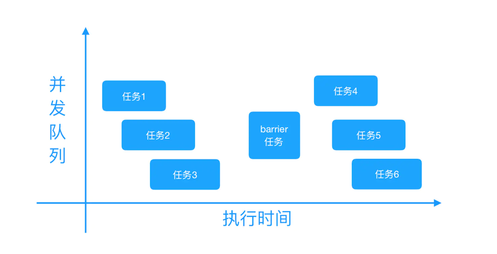

# 多线程
NSThread	
	
GCD		

- **[GCD简介](#gcd简介)**
- **[我们为什么要使用GCD呢？](#我们为什么要使用GCD呢？)**
- **[GCD任务和队列](#gcd任务和队列)**
- **[GCD的其他方法](gcd的其他方法:)**
- **[GCD将异步执行改为顺序执行](gcd将异步执行改为顺序执行)**

NSOperation	
  	
- **[NSOperation简介](#nsoperation简介)**
- **[为什么要使用 NSOperation、NSOperationQueue?](为什么要使用NSOperation、NSOperationQueue?)**
- **[NSOperation和NSOperationQueue基本使用](NSOperation和NSOperationQueue基本使用)**


## 1.NSThread

## 2.GCD
### GCD简介
Grand Central Dispatch(GCD)是Apple开发的一个多核编程的较新的解决方法。它主要用于优化应用程序以支持多核处理器的系统。它是一个在线程池模式的基础上执行的并行任务。在Mac OS X 10.6雪豹中首次推出，对应iOS版本为iOS4.0。
### 我们为什么要使用GCD呢？
* GCD 可用于多核的并行运算
* GCD 会自动利用更多的CPU内核(比如双核，四核)
* GCD 会自动管理线程的生命周期(创建任务，调度任务，销毁线程)
* 程序员只需要告诉GCD 想要执行什么任务，不需要编写任何线程管理代码	

### GCD任务和队列
GCD 两个核心概念: **『任务』** 和 **『队列』**。	
**任务**: 就是执行操作的意思，换句话说就是你在线程中执行的那段代码。在GCD 中是放在block中的。执行任务有两种方式:**『同步执行』** 和 **『异步执行』**。两者的主要区别是: **是否等待队列中的任务执行结束，以及是否具备开启新线程的能力**。  

* **同步执行(sync)**		
	* 同步添加任务到指定的队列中，在添加的任务执行结束之前，会一直等待，直到队列中的任务完成之后再继续执行
	* 只能在当前线程中执行任务，不具备开启新线程的能力  
* **异步执行(async)**  
	* 异步添加任务到指定的队列中，它不会做任何等待，可以继续执行任务。
	* 可以在新线程中执行任务，具备开启新线程的能力。
   
> **注意：异步执行(async) 虽然具备开启新线程的能力，但不一定开启新线程。这跟任务所指定的队列类型有关**  

**队列(Dispatch Queue)**: 这里的队列指执行任务的队列，即用来存放任务的队列。队列是一种特殊的线性表，采用FIFO(先进先出)的原则，即新任务总是呗插入到队列的末尾，而读取任务的时候总是从队列的头部开始读取。每读取一个任务，则从队列中释放一个任务。在GCD 中有两种队列 **『串行队列』** 和 **『并发队列』**。两者都符合FIFO的原则。两者的主要区别是: **执行顺序不同，以及开启线程数不同。**  

* **串行队列(Serial Dispatch Queue):**  
	* 每次只有一个任务被执行。让任务一个接一个的执行。(只开启一个线程，一个任务执行完毕，再执行下一个任务)
* **并发队列(Concurrent Dispatch Queue):**
	* 可以让多个任务并发(同时)执行。(可以开启多个线程,并同时执行任务)
	
> 注意: **并发队列** 的并发功能只有在异步方法下才有效

### GCD的其他方法
1. **GCD 栅栏方法:(```dispatch_barrier_async```)**   
我们有时需要异步执行两组操作，而且第一组操作执行完之后，才能开始执行第二组操作。这样我们就需要一个相当于 **栅栏** 一样的一个方法将两组异步执行的操作组给分割起来，当然这里的操作组里可以包含一个或多个任务。这就需要用到```dispatch_barrier_async``` 方法在两个操作组间形成栅栏。
```dispatch_barrier_async``` 方法会等待前边追加到并发队列中的任务全部执行完毕之后，再将指定的任务追加到该异步队列中。然后在 ```dispatch_barrier_async``` 方法追加的任务执行完毕之后，异步队列才恢复为一般动作，接着追加任务到该异步队列并开始执行。具体如下图所示：  


### GCD将异步执行改为顺序执行
1. ```dispatch_group```将异步网络请求顺序执行，```dispatch_group_wait ```会阻塞当前线程，所以下边代码会阻塞线程
	<details open>
 	 <summary>dispatch_group 模拟网络请求同步执行,注意堵塞线程的问题</summary>
 	 
 ```swift											-(void)testGroup1 {
  		dispatch_group_t group = dispatch_group_create();
    dispatch_group_enter(group);
    [self loadDataPar:@"1" callBack:^(NSString *string) {
        NSLog(@"%@", string);
        dispatch_group_leave(group);
    }];
    dispatch_group_wait(group, DISPATCH_TIME_FOREVER);
    dispatch_group_enter(group);
    [self loadDataPar:@"2" callBack:^(NSString *string) {
        NSLog(@"%@", string);
        dispatch_group_leave(group);
    }];
    dispatch_group_wait(group, DISPATCH_TIME_FOREVER);
    dispatch_group_enter(group);
    [self loadDataPar:@"3" callBack:^(NSString *string) {
        NSLog(@"%@", string);
        dispatch_group_leave(group);
    }];
    dispatch_group_wait(group, DISPATCH_TIME_FOREVER);
    dispatch_group_notify(group, dispatch_get_main_queue(), ^{
        NSLog(@"任务完成");
	    });
  }
  -(void)loadDataPar:(NSString*)num callBack:(void(^)(NSString *string))block {
 dispatch_queue_t queue = dispatch_get_global_queue(DISPATCH_QUEUE_PRIORITY_DEFAULT, 0);
    dispatch_queue_t mainQueue = dispatch_get_main_queue();
    dispatch_async(queue, ^{
        NSLog(@"%@",[NSThread currentThread]);
        // 这里返回的话会阻塞线程的
        <!--dispatch_async(mainQueue, ^{
            block(num);
        });-->
        block(num);
    });
 }
 ```
  </details>      
  	
 2.```dispatch_semaphore```
	<details open>
      <summary>dispatch_semaphore 模拟网络请求同步执行，注意堵塞线程的问题</summary>
  
  ```swift										- (void)testAsyncToSync {
    dispatch_semaphore_t sema = dispatch_semaphore_create(0);
    // 注意堵塞线程的问题,不能再主线程调用
    dispatch_queue_t queue = dispatch_get_global_queue(DISPATCH_QUEUE_PRIORITY_DEFAULT, 0);
    dispatch_async(queue, ^{
        [self loadDataPar:@"1" callBack:^(NSString *string) {
            NSLog(@"%@", string);
            dispatch_semaphore_signal(sema);
        }];
        dispatch_semaphore_wait(sema, DISPATCH_TIME_FOREVER);
        [self loadDataPar:@"2" callBack:^(NSString *string) {
            NSLog(@"%@", string);
            dispatch_semaphore_signal(sema);
        }];
        dispatch_semaphore_wait(sema, DISPATCH_TIME_FOREVER);
        [self loadDataPar:@"3" callBack:^(NSString *string) {
            NSLog(@"%@", string);
            dispatch_semaphore_signal(sema);
        }];
        dispatch_semaphore_wait(sema, DISPATCH_TIME_FOREVER);
        dispatch_async(dispatch_get_main_queue(), ^{
            NSLog(@"全部搞完了 %@",[NSThread currentThread]);
        });
    });
    ```
  </details> 


## 3. NSOperation
### NSOperation简介 	
NSOperation、NSOperationQueue 是苹果提供给我们的一套多线程解决方案。实际上 NSOperation、NSOperationQueue 是基于 GCD 更高一层的封装，完全面向对象。但是比 GCD 更简单易用、代码可读性也更高


### 为什么要使用 NSOperation、NSOperationQueue?
1. 可添加完成的代码块，在操作完成后执行。
2. 添加操作之间的依赖关系，方便的控制执行顺序。
3. 设定操作执行的优先级。
4. 可以很方便的取消一个操作的执行。
5. 使用 KVO 观察对操作执行状态的更改：isExecuteing、isFinished、isCancelled。

### NSOperation和NSOperationQueue基本使用
1.```NSInvocationOperation```   
在没有使用 NSOperationQueue、在主线程中单独使用使用子类 NSInvocationOperation 执行一个操作的情况下，操作是在当前线程执行的，并没有开启新线程。   
在其他线程中单独使用子类 NSInvocationOperation，操作是在当前调用的其他线程执行的，并没有开启新线程。	
2. ```NSBlockOperation```	
	2.1. 	 使用```blockOperationWithBlock```初始化的话，操作在当前线程中执行，不开启新的线程

```swift
NSBlockOperation *op = [NSBlockOperation blockOperationWithBlock:^{
        for (int i = 0; i < 2; i++) {
            [NSThread sleepForTimeInterval:2]; // 模拟耗时操作
            NSLog(@"1---%@", [NSThread currentThread]); // 打印当前线程
        }
    }];
    // 2.调用 start 方法开始执行操作
   [op start];
```

2.2. 通过```addExecutionBlock``` 添加额外的操作，这些操作包括```blockOperationWithBlock ```中的操作可以再不同的线程中同时(并发)执行，如果添加的操作多的话，```blockOperationWithBlock:``` 中的操作也可能会在其他线程（非当前线程）中执行，这是由系统决定的，并不是说添加到 ```blockOperationWithBlock:``` 中的操作一定会在当前线程中执行。（可以使用 ```addExecutionBlock:``` 多添加几个操作试试）

```swift
NSBlockOperation *op = [NSBlockOperation blockOperationWithBlock:^{
    [NSThread sleepForTimeInterval:2];
    NSLog(@"主线程======%@",[NSThread currentThread]);
}];
for (int i = 0; i < 100; i++) {
    [op addExecutionBlock:^{
        [NSThread sleepForTimeInterval:2];
        NSLog(@"%d======%@",i+1,[NSThread currentThread]);
    }];
}
[op start];
```

一般情况下，如果一个 NSBlockOperation 对象封装了多个操作。NSBlockOperation 是否开启新线程，取决于操作的个数。如果添加的操作的个数多，就会自动开启新线程。当然开启的线程数是由系统来决定的。


* 重写的方法

```swift
// 对于并发的Operation需要重写改方法 SDWebImage
- (void)start;

// 非并发的Operation需要重写该方法 Toaster 吐司，注意不需要使用@autoreleasepool
- (void)main;
```

## GCD与NSOperationQueue区别

最直接的区别就是: GCD是底层的C语言构成的API，而NSOperationQueue及相关对象是Objc的对象。在GCD中，在队列中执行的是由block构成的任务，这是一个轻量级的数据结构；而Operation作为一个对象,我们能够对NSOperation进行继承，在这之上添加成员变量与成员方法，提高整个代码的复用度，这比简单地将block任务排入执行队列更有自由度，能够在其之上添加更多自定制的功能。NSOperationQueue可以支持KVO可以监听任务的状态属性;而GCD不可以


1.  NSOperationk可以很方便的控制最大并发数： maxConcurrentOperationCount
	<details open>
      <summary>GCD 控制最大并发数</summary>
      
      ```swift
       dispatch_queue_t workConcurrentQueue = dispatch_queue_create("concurrentRunMaxThreadCountWithGCD", DISPATCH_QUEUE_CONCURRENT);
    dispatch_queue_t serialQueue = dispatch_queue_create("serialRunMaxThreadCountWithGCD", DISPATCH_QUEUE_SERIAL);
    // 创建一个semaphore,并设置最大信号量，最大信号量表示最大线程数量
    dispatch_semaphore_t semaphore = dispatch_semaphore_create(2);
    // 使用循环往串行队列 serialQueue 增加 10 个任务
    for (int i = 0; i < 100 ; i++) {
        dispatch_async(serialQueue, ^{
            // 只有当信号量大于 0 的时候，线程将信号量减 1，程序向下执行
            // 否则线程会阻塞并且一直等待，直到信号量大于 0
            dispatch_semaphore_wait(semaphore, DISPATCH_TIME_FOREVER);
            dispatch_async(workConcurrentQueue, ^{
                NSLog(@"%@ 执行任务一次  i = %d",[NSThread currentThread],i);
                sleep(1);
                // 当线程任务执行完成之后，发送一个信号，增加信号量。
                dispatch_semaphore_signal(semaphore);
            });
        });
    }
    NSLog(@"%@ 执行任务结束",[NSThread currentThread]);
      ```
    </details> 

2. NSOperation能够方便的设置依赖关系，我们可以让一个 Operation 依赖于另一个 Operation ，这样尽管两个Operation 处于同一个并行队列中，单前者会直到后者执行完毕后再执行，而GCD 需要使用```dispatch_group``` 搭配```dispatch_group_enter()```和```dispatch_group_leave()```
3. NSOperation可以直接调用 [op cancel]取消掉一个未执行的操作,而GCD需要
	<details open>
      <summary>GCD 取消操作</summary>
      
      ```swift
      dispatch_queue_t queue = dispatch_queue_create("com.gcdtest.www", DISPATCH_QUEUE_CONCURRENT);
       dispatch_block_t block1 = dispatch_block_create(0, ^{
        sleep(5);
        NSLog(@"block1 %@",[NSThread currentThread]);
    });
    
    dispatch_block_t block2 = dispatch_block_create(0, ^{
        NSLog(@"block2 %@",[NSThread currentThread]);
    });
    
    dispatch_block_t block3 = dispatch_block_create(0, ^{
        NSLog(@"block3 %@",[NSThread currentThread]);
    });
 dispatch_async(queue, block1);
    dispatch_async(queue, block2);
    dispatch_block_cancel(block3);
      ```
      
      </details> 
     或者 定义局部变量，用于标记block是否需要取消
     
4.我们能够对NSOperation进行继承，在这之上添加成员变量与成员方法，提高整个代码的复用度，这比简单地将block任务排入执行队列更有自由度，能够在其之上添加更多自定制的功能。
 5. 我们能将KVO应用于NSOperation中，可以监听一个Operation 是否完成或者取消，这样能比GCD更加有效的掌控我们执行的后台任务。
