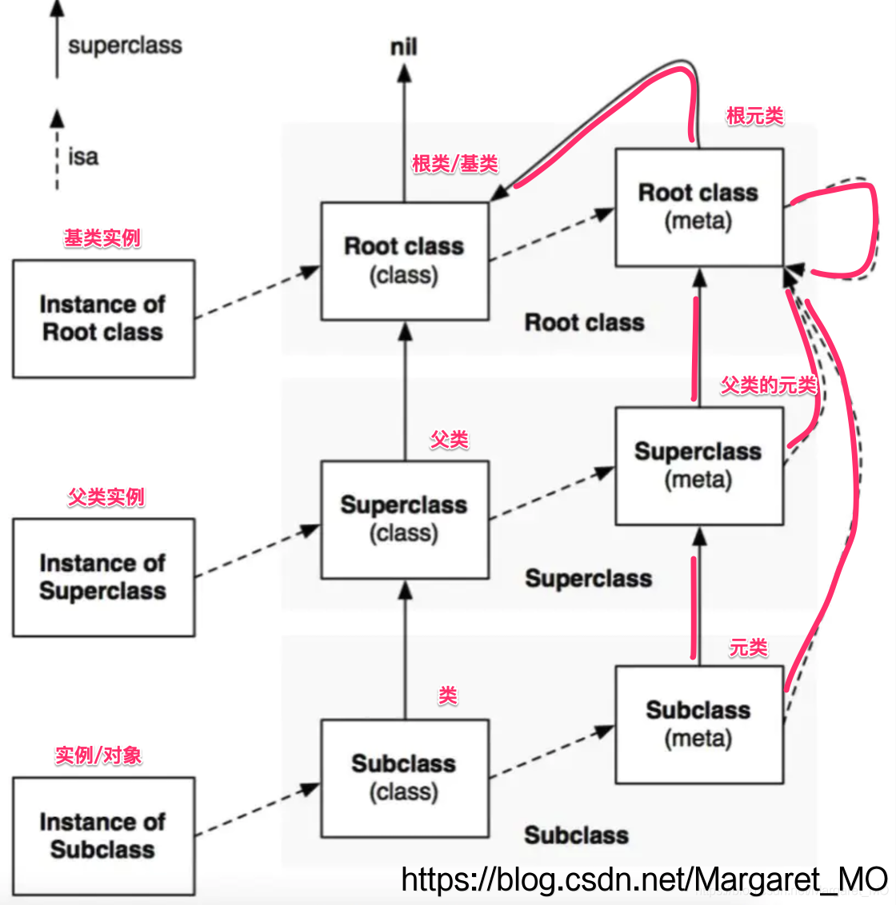
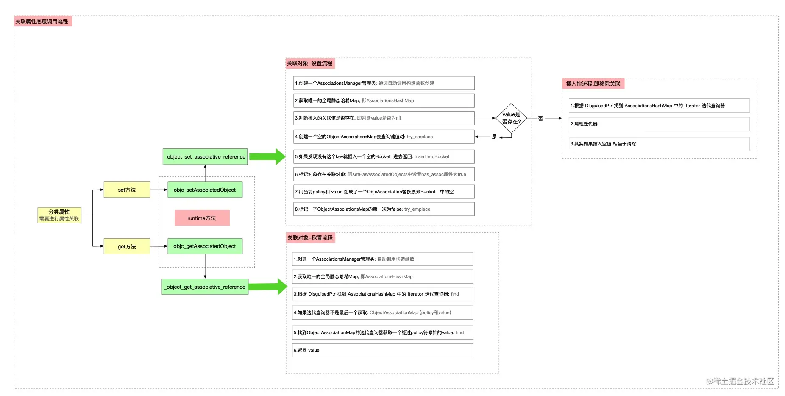

# Runtime
 -[```objc``` 对象的```isa``` 的指针指向什么?有什么作用?](#```objc``` 对象的```isa``` 的指针指向什么?有什么作用?)
 
-[分类为什么不能添加实例变量的原因](#分类为什么不能添加实例变量的原因)


## ```objc``` 对象的```isa``` 的指针指向什么?有什么作用?

isa 其实是一个 union isa_t 的联合体：

```
union isa_t 
{
    isa_t() { }
    isa_t(uintptr_t value) : bits(value) { }

    Class cls;
    uintptr_t bits;

#if SUPPORT_PACKED_ISA

    // extra_rc must be the MSB-most field (so it matches carry/overflow flags)
    // nonpointer must be the LSB (fixme or get rid of it)
    // shiftcls must occupy the same bits that a real class pointer would
    // bits + RC_ONE is equivalent to extra_rc + 1
    // RC_HALF is the high bit of extra_rc (i.e. half of its range)

    // future expansion:
    // uintptr_t fast_rr : 1;     // no r/r overrides
    // uintptr_t lock : 2;        // lock for atomic property, @synch
    // uintptr_t extraBytes : 1;  // allocated with extra bytes

# if __arm64__
#   define ISA_MASK        0x0000000ffffffff8ULL
#   define ISA_MAGIC_MASK  0x000003f000000001ULL
#   define ISA_MAGIC_VALUE 0x000001a000000001ULL
    struct {
    	// 0 代表普通指针，存储这Class，Meta-Class对象的内存地址
    		// 1 代表优化过，使用位域存储更多信息
        uintptr_t nonpointer        : 1;
        // 是否设置过关联类型，如果没有，释放会更快
        uintptr_t has_assoc         : 1;
        // 是否有C++的析构函数(.cxx_destruct)，如果没有，释放会更快
        uintptr_t has_cxx_dtor      : 1;
        // 存储着Class，Meta-Class对象的内存地址信息
        uintptr_t shiftcls          : 33; // MACH_VM_MAX_ADDRESS 0x1000000000
        // 用于在调试时分辨对象是否初始化完成
        uintptr_t magic             : 6;
        // 是否有被弱引用指向过，如果没有，释放会更快
        uintptr_t weakly_referenced : 1;
        // 对象是否使用
        uintptr_t unused      : 1;
        // 引用计数是否过大无法存储在isa中
        	// 若果为1 那么引用计数会存储在一个叫SideTable的类的属性中
        uintptr_t has_sidetable_rc  : 1;
        // 里面存储的值是引用计数 减1
        uintptr_t extra_rc          : 19;
#       define RC_ONE   (1ULL<<45)
#       define RC_HALF  (1ULL<<18)
    };

# elif __x86_64__
#   define ISA_MASK        0x00007ffffffffff8ULL
#   define ISA_MAGIC_MASK  0x001f800000000001ULL
#   define ISA_MAGIC_VALUE 0x001d800000000001ULL
    struct {
        uintptr_t nonpointer        : 1;
        uintptr_t has_assoc         : 1;
        uintptr_t has_cxx_dtor      : 1;
        uintptr_t shiftcls          : 44; // MACH_VM_MAX_ADDRESS 0x7fffffe00000
        uintptr_t magic             : 6;
        uintptr_t weakly_referenced : 1;
        uintptr_t deallocating      : 1;
        uintptr_t has_sidetable_rc  : 1;
        uintptr_t extra_rc          : 8;
#       define RC_ONE   (1ULL<<56)
#       define RC_HALF  (1ULL<<7)
    };

# else
#   error unknown architecture for packed isa
# endif

// SUPPORT_PACKED_ISA
#endif


#if SUPPORT_INDEXED_ISA

# if  __ARM_ARCH_7K__ >= 2

#   define ISA_INDEX_IS_NPI      1
#   define ISA_INDEX_MASK        0x0001FFFC
#   define ISA_INDEX_SHIFT       2
#   define ISA_INDEX_BITS        15
#   define ISA_INDEX_COUNT       (1 << ISA_INDEX_BITS)
#   define ISA_INDEX_MAGIC_MASK  0x001E0001
#   define ISA_INDEX_MAGIC_VALUE 0x001C0001
    struct {
        uintptr_t nonpointer        : 1;
        uintptr_t has_assoc         : 1;
        uintptr_t indexcls          : 15;
        uintptr_t magic             : 4;
        uintptr_t has_cxx_dtor      : 1;
        uintptr_t weakly_referenced : 1;
        uintptr_t deallocating      : 1;
        uintptr_t has_sidetable_rc  : 1;
        uintptr_t extra_rc          : 7;
#       define RC_ONE   (1ULL<<25)
#       define RC_HALF  (1ULL<<6)
    };

# else
#   error unknown architecture for indexed isa
# endif

// SUPPORT_INDEXED_ISA
#endif

};
```


	指向他的类对象，从而可以找到类对象上的方法。
	


OC中任何类的定义都是对象，任何对象都有```isa```指针。```isa```是一个Class类型的指针。
### isa指针
实例的isa指针，指向类。

类的isa指针，指向元类。

元类的isa指针，指向根元类。

父元类的isa指针，也指向根元类！！！

根元类的isa指针，指向它自己！！！
### superClass
类的superClass指向父类。

父类的superClass指向根类。

根类的superClass指向nil。

元类的superClass指向父元类。

父元类的superClass指向根元类。

根元类的superClass指向根类！！！

### objc_msgSend为什么是用汇编写的，而不是C

`C语言`不能通过写一个函数，保留未知的参数，跳转到任意的指针，而汇编有寄存器，对于一些调用频率太高的函数或者操作，使用汇编来实现能够提高效率和性能，容易被机器识别

##分类为什么不能添加实例变量的原因？
分类 Category 实际是一个category_t结构体,包含了 实例方法列表，类方法列表， 协议列表和属性列表但是没有实例变量列表，Category在运行期，对象的内存布局已经确定，如果添加实例变量就会破坏类的内部结构.

为什么分类的方法要将实例方法和类方法分开来存呢？

> 分类有两个方法列表是因为分类是没有元类的，分类的方法是在运行时通过 attachToClass 插入到 class 的。
		
		
只要有一个分类是非懒加载分类(分类实现+load方法)，那么所有的分类都会被标记位非懒加载分类，意思就是加载一次 已经开辟了rwe，就不会再次懒加载，重新去处理 TCJPerson

```
struct category_t {
        //类的名字
        const char *name;
        //类
        classref_t cls;
        //category中所有给类添加的实例方法的列表
        struct method_list_t *instanceMethods;
        //category中所有添加的类方法的列表
        struct method_list_t *classMethods;
        //category实现的所有协议的列表
        struct protocol_list_t *protocols;
        //category中添加的所有属性
        struct property_list_t *instanceProperties;

        method_list_t *methodsForMeta(bool isMeta) {
            if (isMeta) return classMethods;
            else return instanceMethods;
        }
        property_list_t *propertiesForMeta(bool isMeta) {
            if (isMeta) return nil; // classProperties;
            else return instanceProperties;
        }
    };
```

## 分类和类的搭配使用总结

类和分类搭配使用，其 数据加载时机总结：

* **非懒加载类 + 非懒加载分类：** 类的加载在 **_read_images** 处，分类的加载在 **load_images**方法中，首先对类进行加载，然后把分类的信息贴在类中。
* **非懒加载类 + 懒加载分类：**类的加载在 **_read_images**处，分类的加载则在**编译时**。
* **懒加载类 + 懒加载分类：**类的加载在**第一次消息发送**的时候，分类的加载则在**编译时**。
* **懒加载类 + 非懒加载分类：**只要分类实现了 **load**，就会迫使主类 **提前加载**，即在**_read_images**中不会对类做实现操作，需要在 **load_images**方法中触发类的数据加载，即 **rwe初始化**,同时加载分类数据。

### Category 和 Extension 的区别
* ```Extension```在编译器决议，它是类的一部分，在编译器和头文件里的```@interface ```以及实现文件里的 ```@implement```一起形成一个完整的类，它伴随这类的产生而产生，亦随之一起消亡。```Extension```一般用来隐藏类的私有信息，你必须有一个类才能为之添加```Extension```，比如你不能为系统的```NSString```添加 ```Extension```
* ```Category```则完全不一样，它是运行期决议的。
* ```Extension```可以添加成员变量，而```Category```不可以。
* 总之，就```Category``` 和 ```Extension```区别来看，```Extension```可以添加成员变量，而```Category```不可以，因为```Category```在运行期，对象的内存布局已经确定，如果添加实例变量就会破坏类的内存布局。

### super 和 self
看下面代码 打印什么?

```
@interface HookPersion : HookBase 

@end
@implementation HookPersion
- (instancetype)init
{
    self = [super init];
    if (self) {
        NSLog(@"%@",NSStringFromClass([self class]));
        NSLog(@"%@",NSStringFromClass([super class]));

    }
    return self;
}
@end
```

> 结果都是打印 HookPersion

原因是: 

**self** 是类的隐藏参数，指向当前调用方法的这个类的实例；

**super** 本质是一个编译器的标识符，和**self**指向同一个消息接受者，不同点在于: **super**会告诉编译器，当调用方法时，去调用父类的方法，而不是本类的方法；

当使用self调用方法时，会从当前类的方法列表中开始找，如果没有，就从父类中再找，而当使用super时，则从父类的方法列表中开始查找，然后调用父类的这个方法。

不管是调用```[self class]``` 还是```[super class]```接收消息的对象都是当前的 HookPersion *xxx对象

当调用 ```[super class]```时，**runtime**会调用```objc_msgSendSuper```方法，而不是```objc_msgSend```

```
[self class] 转化为: id objc_msgSend(id self, SEL op, ...)


[super class] 转化为: id objc_msgSendSuper(struct objc_super *super, SEL op, ...)
第一个参数为： objc_super这样一个结构体，定义如下：
struct objc_super {
      __unsafe_unretained id receiver;
      __unsafe_unretained Class super_class;
};
结构体有两个成员，第一个成员是 receiver, 类似于上面的 objc_msgSend函数第一个参数self 。第二个成员是记录当前类的父类是什么。
当调用[super class]时，会转化为 objc_msgSendSuper 
第一步先构造 objc_super 结构体，结构体第一个成员就是 self 。
第二个成员是 (id)class_getSuperclass(objc_getClass(“Son”)) , 实际该函数输出结果为 HookBase。
第二步是去 HookBase这个类里去找 - (Class)class，没有，然后去NSObject类去找，找到了。最后内部是使用 objc_msgSend(objc_super->receiver, @selector(class))去调用，此时已经和[self class]调用相同了

```
> 

### objc中的类方法和实例方法有什么本质区别和联系？
类方法(+ 方法):

	1. 	类方法是属于类对象的
	2. 类方法只能通过类对象调用
	3. 类方法中的self是类对象
	4. 类方法可以调用其他的类方法
	5. 类方法中不能访问成员变量
	6. 类方法中不能“直接”调用对象方法

实例方法(- 方法):

	1. 实例方法是属于实例对象的
	2. 实例方法只能通过实例对象调用
	3. 实例方法中的self是实例对象
	4. 实例方法中可以访问成员变量
	5. 实例方法中直接调用实例方法
	6. 实例方法中也可以调用类方法(通过类名)

### weak的实现原理
weak，此特质表明该属性定义了一种"非拥有关系"，为这种属性设置新值时，设置方法即不保留新值，也不会释放旧值，然而在属性所指的对象遭到摧毁时，属性值也会清空置为nil。

Runtime维护了一个weak表，用于存储指向某个对象的所有weak指针。weak表其实是一个hash(哈希)表,key是所指对象的地址，value是weak指针的地址(weak指针的地址 = 所指对象指针的地址 )数组。

1. 初始化时： runtime 会调用 ```objc_initWeak```函数，初始化一个新的weak指针指向对象的地址。
2. 添加引用时： ```objc_initWeak``` 函数会调用```objc_storeWeak```函数，```objc_storeWeak```的作用是更新指针指向，创建对应的弱引用表。
3. 释放时，调用```clearDeallocating```函数，```clearDeallocating```函数首先根据对象的地址找到所有weak指针地址的数组，然后遍历这个数组把其中的数据置为nil,最后把这个entry从weak表中删除，最后清理对象的记录。调用函数流程为 :

	1. 首先调用 objc_release
	2. 因为对象的引用计数为0，所以执行dealloc
	3. 在dealloc 中调用 ```_objc_rootDealloc```
	4. 在 ```_objc_rootDealloc```中调用 ```object_dispose```函数
	5. 调用 ```objc_destructInstance```
	6. 最后调用 ```objc_clear_deallocating```
	
	

### Runtime Asssociate方法关联的对象，需要我们手动释放吗?
不需要,当我们对象释放的时候会调用dealloc函数，在dealloc函数内部会

1. C++函数释放: `objc_cxxDestruct `
2. 移除关联属性: `_object_remove_assocations `
3. 将弱引用自动设置nil: `weak_clear_no_lock`
4. 引用计数处理: `table.refcnts.erase`
5. 销毁对象: `free(obj)`

不需要，因为当我们对象释放时会调用dealloc ，dealloc内部调用 ```_objc_rootDealloc``` 方法 -> `rootDealloc` 会判断是否有关联对象，有的话会执行`object_dispose `内部调用`objc_destructInstance`再次判断是否有关联对象，有的话执行`_object_remove_assocations`移除关联对象

```
inline void
objc_object::rootDealloc()
{
    if (isTaggedPointer()) return;  // fixme necessary?

    if (fastpath(isa.nonpointer                     &&
                 !isa.weakly_referenced             &&
                 !isa.has_assoc                     &&
#if ISA_HAS_CXX_DTOR_BIT
                 !isa.has_cxx_dtor                  &&
#else
                 !isa.getClass(false)->hasCxxDtor() &&
#endif
                 !isa.has_sidetable_rc))
    {
        assert(!sidetable_present());
        free(this);
    } 
    else {
        object_dispose((id)this);
    }
}
```
会判断是否需要调用```object_dispose ->  objc_destructInstance 内部 _object_remove_assocations```





### 方法的本质，sel是什么？IMP是什么？两者之间的关系又是什么？
方法的本质: 发送消息，发送消息会有以下几个流程:
 
 1. 快速查找流程 - 通过汇编`objc_msgSend `查找缓存`cache_t `是否有`imp`实现。
 2. 慢查找流程 - 通过`C++`中`lookUpImpOrForward`递归查找当`前类和父类的rw`中`methodlist`的方法
 3. 查找不到消息： 动态方法解析 - 通过调用`resolveInstanceMethod `或者`resolveClassMethod `来动态方法决议-实现消息动态处理。
 4. 快速转发流程 - 通过`forwardingTargetForSelector `实现快速转发，由其他对象来实现处理方法。
 5. 慢转发流程- 先调用`methodSignatureForSelector `获取方法的签名，生成对应的`invocation`，再通过`forwardInvocation `来进行处理。

`SEL`是方法编号，也是方法名，`imp`是`函数实现指针`。`SEL`在`dyld`加载镜像到内存时，通过`_read_image`方法加载到内存的表中。

`SEL`和`IMP`的关系我们可以理解为: `sel`相当于书本的`目录标题`，`imp`相当于书本的`页码`，`具体的函数`就是具体页面对应的内容。

### 消息流程 objc_msgSend
1.  `快速查找流程`: 首先，在`类的缓存cache`中查找指定方法的实现。
2. `慢速查找流程`： 如果缓存没有找到，则在`类的方法列表中`查找，如果还没找到，则去`父类链的缓存和方法列表`中查找。
3. `动态方法决议`: 如果慢速查找还是没找到，`第一次补救机会`就是`尝试一次动态方法决议`，即重写`resolveInstanceMethod/resolveClassMethod`方法。
4. 消息转发: 如果动态方法决议还是没找到，则进行`消息转发`，消息转发中有两次补救机会: `快速转发` + `慢速转发`；
	1.  快速转发： 重写 `forwardingTargetForSelector` 传入一个消息备用接受者
	2. 慢速战法: 重写 `methodSignatureForSelector` (扩展： 内部调用流程会重新走一下动态方法决议，断点查看)尝试获取一个方法签名，重写`forwardInvocation`这里做最后处理
5. 如果转发之后也没有，则程序直接报错崩溃`unrecognized selector sent to instance`

### Runtime 在项目中的使用
* 关联对象: 给分类添加属性，AssociatedObject
* 遍历类的所有成员变量: 字典转模型，自动归档解档
* 交换方法实现: 交换系统方法
* 利用消息转发机制: 解决[方法找不到]的异常