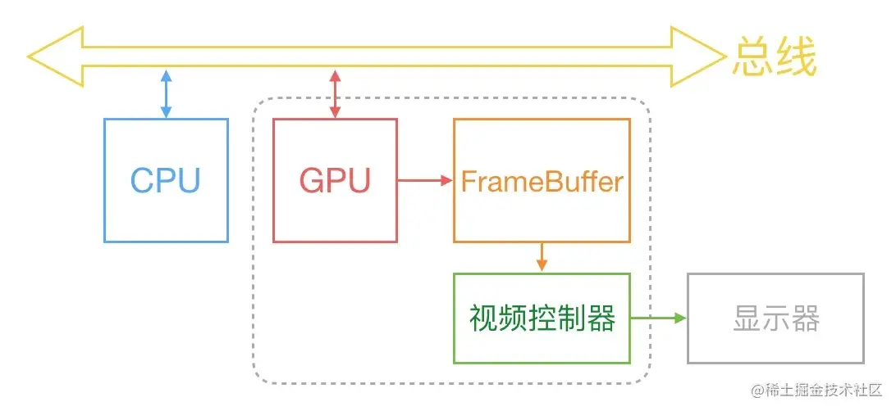

[界面优化](https://juejin.cn/post/6937302554808320014)
## 1.界面卡顿
通常来说，计算机中的显示过程是下面这样的，通过**CPU**、**GPU**、**显示器**协同工作来将图片显示到屏幕上


1.```CPU ```计算好显示内容，提交至```GPU```	
2.```GPU```经过渲染完成后将渲染的结果放入```FrameBuffer```（帧缓存区）  
3.随后视频控制器会按照```VSync```信号逐行读取```FrameBuffer```的数据   
4.经过可能的```数模转换```传递给显示器进行显示   
> 最开始的时候，```FrameBuffer```只有一个，这种情况下```FrameBuffer```的读取和刷新有很大的效率问题，为了解决这个问题，引入了```双缓存区```，即```双缓冲机制```。在这种情况下，```GPU```会先预渲染**一帧**放入```FrameBuffer```，让视频控制器读取，当下一帧渲染好后，**GPU**会直接将视频控制器的指针指向第二个```FrameBuffer```。   

> 双缓存机制虽然解决了效率问题，但是随之而言的是新的问题，当视频控制器还未读取完成时，例如屏幕内容刚显示一半，GPU将新的一帧内容提交到FrameBuffer，并将两个FrameBuffer进行交换后，视频控制器就会将新的一帧数据的下半段显示到屏幕上，造成屏幕撕裂现象.   

> 为了解决这个问题，采用了垂直同步信号机制.当开启垂直同步后，GPU会等待显示器的VSync信号发出后，才进行新的一帧渲染和FrameBuffer更新.而目前iOS设备中采用的正是双缓存区+VSync.

